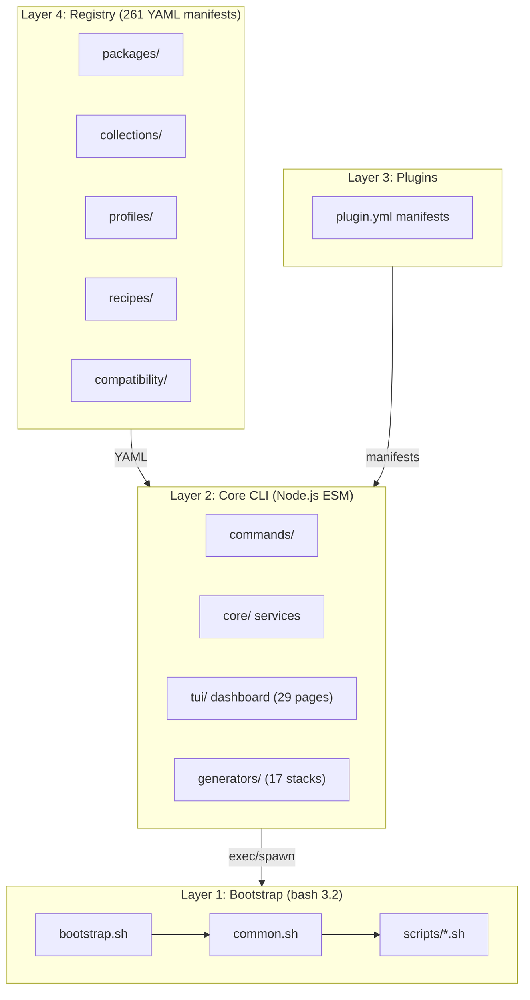

<div align="center">


# DevForgeKit

The complete local-first development environment platform for building, managing, analyzing, and maintaining professional developer workstations.

[Website](https://devforgekit.dev) &middot; [Documentation](#documentation) &middot; [Quick Start](#quick-start) &middot; [Contributing](CONTRIBUTING.md)

</div>

---

<div align="center">

**Version 3.0.1-rc1** &middot; **MIT License** &middot; **macOS / Linux / Windows** &middot; **Node.js ESM**

| | | | |
| :---: | :---: | :---: | :---: |
| **261** Registry Packages | **17** Project Generators | **20** TUI Themes | **8** Plugin Templates |
| **50** Environment Profiles | **17** Collections | **8** Recipes | **196** Compatibility Rules |
| **29** TUI Pages | **1,350** Tests | **7** AI Providers | **12** Benchmark Categories |

</div>

---

## Quick Navigation

| | | | |
| :--- | :--- | :--- | :--- |
| [Features](#features) | [Installation](#installation) | [Quick Start](#quick-start) | [Commands](#commands) |
| [Architecture](#architecture) | [Documentation](#documentation) | [Screenshots](#screenshots) | [Roadmap](#roadmap) |
| [Contributing](#contributing) | [License](#license) | [Troubleshooting](#troubleshooting) | [FAQ](#faq) |

---

## Features

<div align="center">

| Feature | Description |
| :--- | :--- |
| **Interactive Dashboard** | Full-screen keyboard-driven TUI with 29 pages, 20 themes, and global search |
| **AI Assistant** | 7 providers (OpenAI, Anthropic, Gemini, Groq, OpenRouter, Ollama, LM Studio) with context engine |
| **Project Generator** | Scaffold production-ready projects for 17 stacks with tests, CI, and Docker |
| **Environment Graph** | Visual dependency graph with 21 node types, 16 edge types, and 7 export formats |
| **Repair Engine** | 12 scanners with dependency-aware repair ordering and automatic rollback |
| **Benchmark Engine** | 12 categories, 3 profiles, comparison, history, and AI-powered analysis |
| **Workspace Manager** | Git/SSH/env/secrets/Docker/K8s/cloud context in one switchable unit |
| **Plugin SDK** | Full lifecycle: create, test, build, package, publish, install with Ed25519 signing |
| **Snapshots** | Portable `.dfk` archives with diff, verify, and cross-machine restore |
| **Compatibility Engine** | Version-range validation, conflict detection, and 5-tier health score |
| **Package Intelligence** | Analyze, orphan detection, duplicates, impact analysis, and recommendations |
| **Registry** | 261 packages across 35 categories with quality scoring and dependency resolution |

</div>

---

## Installation

**npm** (recommended):

```bash
npm install -g devforgekit@next
devforgekit install
```

`@next` currently points at the same `v3.0.1-rc1` release candidate npm's `latest` tag also resolves to right now (npm always assigns `latest` to a package's very first publish - `latest` and `@next` diverge automatically the moment a real `v3.0.1` stable ships, no README change needed).

**Homebrew:**

```bash
brew tap NouradinAbdurahman/devforgekit
brew install devforgekit
devforgekit install
```

**From source** (for contributing, or to run without installing a package):

```bash
git clone https://github.com/NouradinAbdurahman/DevForgeKit.git
cd DevForgeKit
chmod +x bootstrap.sh devforgekit
./devforgekit install
```

**Requirements:** macOS (Apple Silicon or Intel) or Linux (Ubuntu/Debian, Fedora/RHEL, Arch) for the npm/Homebrew packages; Node.js 18+; internet connection. Windows: use WSL, or the source install directly.

`devforgekit install` is a separate, explicit step from installing the `devforgekit` command itself (whichever channel you used) - it provisions your actual workstation: Homebrew, mise, dotfiles, editors, services. On a first-ever run in a real terminal (no `--profile` flag, no `-y`), you get an interactive wizard — Minimal / Recommended / Full / Custom, then opt-in prompts for VS Code/Cursor extensions and starting local services, then a preview before anything installs. Any flag, `-y`, or non-interactive/CI usage skips the wizard and installs exactly what you specify, unchanged. See [docs/Profiles.md](docs/Profiles.md).

**Flags:** `--profile <name>` (flutter, backend, recommended, minimal, full), `--dry-run`, `--skip-services`, `-y/--yes`

Every script is idempotent — safe to run more than once. Nothing is reinstalled, recopied, or restarted unless it's actually missing or different.

---

## Shell Completions

Tab-completion for `devforgekit` commands and subcommands, for zsh, bash, and fish.

**Homebrew installs** get completions automatically — the formula registers them, nothing to do.

**npm installs** (`npm install -g devforgekit`) ship the completion scripts in the package but don't wire them into your shell by default, since there's no npm equivalent of Homebrew's completion directories. Enable them with one command:

```bash
devforgekit completion install
```

This detects your current shell from `$SHELL` and installs for it. Restart your shell (or run `exec $SHELL`) to pick it up.

**Install for a specific shell**, or every shell on your machine:

```bash
devforgekit completion install --shell zsh
devforgekit completion install --shell bash
devforgekit completion install --shell fish
devforgekit completion install --all
```

**Manual install**, if you'd rather not have `devforgekit` touch your shell config — source the packaged script directly. Find its real location with `npm root -g`:

```bash
# zsh / bash
source "$(npm root -g)/devforgekit/completions/devforgekit.zsh"   # or .bash

# fish (auto-loads anything placed here, no sourcing needed)
cp "$(npm root -g)/devforgekit/completions/devforgekit.fish" ~/.config/fish/completions/
```

**Uninstall:**

```bash
devforgekit completion uninstall          # your current shell
devforgekit completion uninstall --all    # every shell
```

**Check status, or diagnose a broken install** (stale after an update, or a manually edited rc block):

```bash
devforgekit completion status
devforgekit completion doctor
```

---

## Quick Start

```bash
# Provision everything
devforgekit install

# Open the interactive dashboard
devforgekit

# Generate a project
devforgekit new nextjs my-app

# Ask the AI assistant
devforgekit ai doctor "flutter doctor shows errors"

# Run deep diagnostics
devforgekit doctor

# Install a curated environment
devforgekit recipe install ai-engineer

# Create a plugin
devforgekit plugin create my-plugin --template simple-command
```

Running from source instead of npm/Homebrew? Use `./devforgekit` (repo-relative) in place of `devforgekit` throughout - both are the same dispatcher.

---

## Commands

| Category | Commands |
| :--- | :--- |
| **Core** | `install`, `uninstall [--all/--packages/--config/--vscode/--cursor/--services]`, `update`, `backup`, `restore`, `self-update`, `check`, `doctor`, `validate`, `inventory`, `report`, `services`, `clean`, `preferences` |
| **Registry** | `component install/list`, `search`, `collection install`, `info`, `stats`, `registry generate/stats/verify/doctor/audit` |
| **Profiles** | `profile list/show/use/install/create/export/import/search` |
| **Recipes** | `recipe list/show/install/create/import/search` |
| **Projects** | `new --list`, `new <stack> [name]` |
| **Plugins** | `plugin create/test/build/package/publish/install/validate/quality/doctor/list/info/run/trust/keygen` |
| **Workspace** | `workspace create/list/show/metadata/switch/deactivate/delete/rename/clone/search/verify/repair/export/import/diff/health/git-capture/shell-init/benchmark`, `workspace snapshot create/list/restore/compare/delete/export`, `workspace rollback`, `workspace env list/set/unset/import/export`, `workspace ssh list/add-identity/remove-identity`, `workspace compatibility scan/repair/history` |
| **Compatibility** | `compatibility scan/check/explain/repair/graph/update/export` |
| **AI** | `ai chat/doctor/explain/review/generate/analyze/summarize/optimize/repair/planner/compare/health/status/fix/models/benchmark/stats/history/setup/providers/export/import/reset`, `ai key add/remove/list/test/rotate/export/import/migrate`, `ai provider list/use`, `ai model list/use` |
| **Graph** | `graph` (`env`/`deps`), `graph open/cache/search/explain/export/verify/stats/path/impact/conflicts/orphan/focus/history` |
| **Packages** | `package analyze/info/tree/graph/orphan/duplicates/unused/outdated/recommend/impact/search/compare/history/export` |
| **Benchmark** | `benchmark` (`bench`/`perf`), `benchmark quick/standard/full/compare/history/export/delete/explain/trend/intelligence/report` |
| **Repair** | `repair` (`fix`/`heal`), `repair install` (fix the CLI's own symlink/deps/failed packages), `repair scan/plan/explain/explain-issues/verify/rollback/rollback-repair/rollback-list/history/export/delete/clean/benchmark` |
| **Snapshot** | `snapshot create/restore/list/inspect/verify/diff/export/delete/explain` |
| **Config** | `config`, `config list/set/get`, `theme list/use/preview/random/export/import/gallery` |
| **Completions** | `completion install/uninstall/status/doctor` (zsh/bash/fish, for npm installs) |
| **TUI** | `devforgekit` (no args), `dashboard [--page <id>]` |

Full reference with all flags: [docs/CommandReference.md](docs/CommandReference.md)

---

## Architecture



**Four layers, zero circular dependencies:**

- **Layer 1** (bash 3.2) — `bootstrap.sh`, `scripts/*.sh`, `common.sh`. Must run on stock macOS. No Node dependency. (Linux/Windows support is via the Layer 2 CLI.)
- **Layer 2** (Node.js ESM) — `cli/`. Command framework, core services, TUI dashboard, project generators. No build step, no JSX.
- **Layer 3** (plugins) — `plugins/` and `~/.devforgekit/plugins/`. Manifest-driven, Ed25519-signed.
- **Layer 4** (registry) — `registry/`. 261 YAML manifests, AJV-validated, dependency-resolved.

Full architecture diagrams: [docs/ArchitectureDiagrams.md](docs/ArchitectureDiagrams.md)

---

## Screenshots

<div align="center">

| | |
| :---: | :---: |
|  |  |
| **Dashboard** | **Components** |
|  |  |
| **Environment Graph** | **Repair Engine** |

</div>

> Additional screenshots (AI Assistant, Workspace Manager, Project Generator) will be added in a future release.

---

## Documentation

### Architecture

| Document | Description |
| :--- | :--- |
| [ArchitectureDiagrams.md](docs/ArchitectureDiagrams.md) | ASCII + Mermaid diagrams for all subsystems |
| [Architecture.md](docs/Architecture.md) | Layer 1 bash architecture, step runner, bash 3.2 constraints |
| [PlatformArchitecture.md](docs/PlatformArchitecture.md) | Full four-layer platform design |
| [CLI.md](docs/CLI.md) | Complete CLI reference with every flag |

### Development

| Document | Description |
| :--- | :--- |
| [CONTRIBUTING.md](CONTRIBUTING.md) | Dev setup, coding standards, testing, PR process |
| [CommandReference.md](docs/CommandReference.md) | Every command in one table |
| [KeyboardShortcuts.md](docs/KeyboardShortcuts.md) | TUI keyboard shortcut reference |
| [MigrationGuide.md](docs/MigrationGuide.md) | Version migration guide |
| [Troubleshooting.md](docs/Troubleshooting.md) | Comprehensive troubleshooting guide |
| [ReleaseProcess.md](docs/ReleaseProcess.md) | Release mechanics |
| [GitHubActions.md](docs/GitHubActions.md) | CI workflow reference |

### Subsystems

| Document | Description |
| :--- | :--- |
| [PluginSdk.md](docs/PluginSdk.md) | Plugin SDK: manifest, templates, lifecycle, signing |
| [ProjectGenerator.md](docs/ProjectGenerator.md) | 17 stacks, Generator Quality Score |
| [AIAssistant.md](docs/AIAssistant.md) | AI provider setup, context engine, prompt library |
| [ProviderAPI.md](docs/ProviderAPI.md) | Provider REST client reference |
| [ContextEngine.md](docs/ContextEngine.md) | Context aggregation design |
| [PromptLibrary.md](docs/PromptLibrary.md) | 10-domain prompt library |
| [MemorySystem.md](docs/MemorySystem.md) | Local event log design |
| [EnvironmentGraph.md](docs/EnvironmentGraph.md) | DEV Graph: 21 node types, 16 edge types |
| [BenchmarkGuide.md](docs/BenchmarkGuide.md) | 12 categories, 3 profiles, comparison |
| [RepairGuide.md](docs/RepairGuide.md) | 12 scanners, repair plans, rollback |
| [WorkspaceManager.md](docs/WorkspaceManager.md) | Git/SSH/env/secrets/Docker/K8s/cloud |
| [CompatibilityEngine.md](docs/CompatibilityEngine.md) | Version-range validation, 5-tier score |
| [TUI.md](docs/TUI.md) | Full TUI reference |
| [Registry.md](docs/Registry.md) | All 261 packages by category |
| [Recipes.md](docs/Recipes.md) | 8 built-in recipes, configure + verify |
| [Profiles.md](docs/Profiles.md) | 50 environment profiles |
| [Customization.md](docs/Customization.md) | How to customize every part |
| [Templates.md](docs/Templates.md) | 14 starter project templates |

---

## Repository Structure

```
DevForgeKit/
├── devforgekit                # CLI dispatcher
├── bootstrap.sh               # Main installer
├── Brewfile                   # Homebrew formulae, casks, extensions
├── mise.toml                  # Pinned runtime versions
├── VERSION                    # Current version
├── CHANGELOG.md               # Release history
├── CONTRIBUTING.md            # Contributing guide
├── LICENSE                    # MIT
├── assets/                    # Banner and screenshots
│   └── github/
│       ├── banner_logo.png
│       └── screenshots/
├── cli/                       # Node.js Core CLI (Layer 2)
│   ├── bin/devforgekit.js     # Entry point
│   ├── src/commands/          # CLI command handlers
│   ├── src/core/              # Core services (registry, installer, AI, graph, ...)
│   ├── src/generators/        # 17 project generators
│   ├── src/tui/               # Interactive dashboard (Ink/React)
│   ├── src/schemas/           # JSON schemas (AJV)
│   └── test/                  # 1,350 tests
├── registry/                  # Component registry (Layer 4)
│   ├── packages/              # 261 YAML manifests
│   ├── collections/           # 17 curated collections
│   ├── profiles/              # 50 environment profiles
│   ├── recipes/               # 8 recipes
│   ├── compatibility/         # 196 compatibility rule files
│   ├── schema/                # JSON schemas
│   └── registry.json          # Generated index
├── plugins/                   # Plugin manifests (Layer 3)
│   └── hello-world/           # Example plugin
├── scripts/                   # Bash scripts (Layer 1)
│   ├── common.sh              # Shared library
│   ├── colors.sh              # ANSI colors
│   ├── install.sh             # Homebrew + Brewfile
│   ├── restore.sh             # Dotfiles + editors
│   ├── backup.sh              # Live config → repo
│   ├── update.sh              # Upgrade everything
│   ├── check.sh               # Health check + score
│   ├── doctor.sh              # Deep diagnostics
│   ├── validate.sh            # Full validation
│   └── release.sh             # Version bump, tag, push
├── templates/                 # 14 starter project templates
├── docs/                      # Deep-dive documentation (44 files)
└── .github/
    ├── workflows/             # CI: bootstrap, shellcheck, lint, cli, release, codeql
    └── dependabot.yml         # Dependency automation
```

---

## Project Statistics

<div align="center">

| Metric | Count |
| :--- | :--- |
| Registry Packages | 261 |
| Project Generators | 17 |
| Environment Profiles | 50 |
| Collections | 17 |
| Recipes | 8 |
| Compatibility Rules | 196 |
| TUI Pages | 29 |
| TUI Themes | 20 |
| Plugin Templates | 8 |
| AI Providers | 7 |
| Benchmark Categories | 12 |
| Repair Scanners | 12 |
| DEV Graph Node Types | 21 |
| DEV Graph Edge Types | 16 |
| Tests | 1,350 |
| Documentation Files | 44 |

</div>

---

## Why DevForgeKit

| Capability | Status |
| :--- | :---: |
| Bootstrap & Provision | ✓ |
| Package Registry (261 packages) | ✓ |
| Interactive TUI Dashboard | ✓ |
| AI Development Assistant | ✓ |
| Project Generator (17 stacks) | ✓ |
| Environment Graph | ✓ |
| Intelligent Repair Engine | ✓ |
| Benchmark Engine | ✓ |
| Workspace Manager | ✓ |
| Plugin SDK | ✓ |
| Environment Snapshots | ✓ |
| Compatibility Engine | ✓ |
| Package Intelligence | ✓ |
| Self-Update System | ✓ |
| Recipe Engine | ✓ |
| Profile System | ✓ |
| Cross-Platform (macOS/Linux/Windows) | ✓ |

---

## Roadmap

### Shipped

- **v1.1** Platform Core — Node.js CLI, registry, plugins
- **v1.1.1** Registry Expansion — 115 components, collections, search
- **v1.1.2** Profiles & Configuration — 50 profiles, config system
- **v1.1.3** Component Ecosystem — 250 components, quality scoring
- **v1.2.0** Plugin SDK — Full lifecycle, Ed25519 signing
- **v1.2.1** Recipe Engine — 8 recipes, configure + verify
- **v1.2.2** Project Generator — 17 stacks
- **v1.2.3** Interactive Terminal Dashboard — Ink/React TUI, 20 themes
- **v1.2.4** Workspace Manager — Git/SSH/env/secrets/Docker/K8s/cloud
- **v1.2.5** Compatibility Engine — scan/explain/repair, 5-tier score
- **v1.3.0** AI Development Assistant — 7 providers, context engine
- **v1.3.1** Self-Update System — git pull + npm + migration + rollback
- **v1.3.2** Environment Snapshot & Restore — Portable `.dfk` archives
- **v1.3.3** Benchmark Engine — 12 categories, 3 profiles
- **v1.3.4** Intelligent Repair Engine — 12 scanners, rollback
- **v1.3.5** Package Intelligence & Analytics — analyze/orphan/impact
- **v1.3.6** Development Environment Graph — 21 node types, 16 edge types
- **v1.3.7** Enhanced Package Installation Status — 17 statuses
- **v2.0.0–v2.0.9** TUI Foundation, Navigation, Search, Themes, Performance
- **v2.1.0–v2.1.9** Excellence passes: Registry, Generator, AI, Graph, Snapshot, Repair, Benchmark, Workspace, Plugin SDK
- **v2.2.0** Documentation & Developer Experience — Architecture diagrams, command reference, keyboard shortcuts, FAQ, troubleshooting, migration guide, contributing guide
- **v2.2.0.1** Premium GitHub README — Landing-page redesign with real statistics, feature cards, Mermaid architecture, documentation hub
- **v2.2.1** Package Ecosystem Excellence — All 261 packages audited, 100% metadata coverage, compatibility rules expanded to 196, average quality score 88%
- **v2.2.2** Performance & Startup Excellence — In-memory caching for all registry loaders, O(1) package lookup, cached search index, CLI response times cut ~50%
- **v2.2.3** Cross-Platform Implementation — Linux (apt/dnf/pacman), Windows (winget/choco/scoop), WSL detection, `platformInstall` schema field, 222 packages updated with cross-platform install steps
- **v2.2.4** Final Polish & Production Readiness — Comprehensive audit: cross-platform language, CommandReference completeness, README commands table, keyboard shortcuts, theme list, AI docs, TUI docs, CLI docs, version consistency. No new features.
- **v3.0.0** First Public Release — Production-ready. Added CODE_OF_CONDUCT.md, PR template, dependabot CLI monitoring. Cleaned up placeholder assets and broken image references.

---

## Development

```bash
# Requirements: macOS/Linux/Windows, Node.js 18+

# Clone and install
git clone https://github.com/NouradinAbdurahman/DevForgeKit.git
cd DevForgeKit
cd cli && npm install

# Run tests
npm test                    # 1,350 tests

# Run lint
npm run lint                # eslint

# Validate the repo
./scripts/validate.sh       # shell, JSON, YAML, Markdown validation

# Test bootstrap without side effects
./bootstrap.sh --dry-run --yes
```

See [CONTRIBUTING.md](CONTRIBUTING.md) for coding standards, testing conventions, and the PR process.

---

## Troubleshooting

| Problem | Solution |
| :--- | :--- |
| Bootstrap step failed | Re-run `devforgekit install` (idempotent) |
| Tool not on PATH | `devforgekit doctor --fix` |
| Services won't start | `devforgekit services status` |
| AI not configured | `export OPENAI_API_KEY=...` then `devforgekit config set aiProvider openai` |
| Plugin won't install | `devforgekit plugin doctor` |
| Dashboard won't open | Ensure TTY, or `DEVFORGEKIT_NO_TUI=1` |
| `registry generate` fails | `devforgekit registry verify` to find invalid YAML |

Full guide: [docs/Troubleshooting.md](docs/Troubleshooting.md)

---

## FAQ

**Does this work on Intel Macs?**
Yes. `common.sh` detects Apple Silicon vs Intel and adjusts the Homebrew prefix accordingly.

**Does this work on Linux/Windows?**
Yes. The CLI (Layer 2) supports Linux (apt/dnf/pacman) and Windows (winget/choco/scoop) with runtime package manager detection. The bash bootstrap (Layer 1) is macOS-focused; Linux/Windows users should use the CLI directly.

**Will `bootstrap.sh` overwrite my `.zshrc`?**
Not silently. `fs_safe_copy` backs up the existing file as `<file>.backup-<timestamp>` before overwriting.

**Is there a lighter install?**
`devforgekit install --profile minimal` installs bare-essentials CLI tooling, `--profile recommended` adds everyday tooling without Flutter/Android/databases. Or `--profile flutter`/`backend` for stack-specific subsets. Run `devforgekit install` with no flags in an interactive terminal for a wizard that walks through these choices.

**Can I use the CLI without the TUI?**
Yes. Any argument skips the TUI: `devforgekit doctor`. Or set `DEVFORGEKIT_NO_TUI=1`.

**How do I uninstall DevForgeKit?**
`devforgekit uninstall` (with no flags, in a real terminal) shows a checklist - installed packages, VS Code/Cursor extensions, configuration, services - and always previews before removing anything. Use `--all`/`--packages`/`--config`/`--vscode`/`--cursor`/`--services` for a specific subset non-interactively (requires `--force`/`-y` outside a real terminal - it never runs unattended silently). Configuration files are backed up as `<file>.backup-<timestamp>` before removal, never deleted outright.

**Does the AI Assistant work without an API key?**
Yes. Every AI command degrades to a clear, actionable message rather than crashing.

**Is this cross-platform?**
Yes. DevForgeKit supports macOS (Homebrew), Linux (apt/dnf/pacman), and Windows (winget/choco/scoop). WSL is detected automatically.

---

## Contributing

Issues and PRs are welcome. See [CONTRIBUTING.md](CONTRIBUTING.md) for development setup, coding standards, testing conventions, and the PR process.

```bash
./scripts/validate.sh              # shell, JSON, YAML, Markdown validation
./bootstrap.sh --dry-run --yes     # preflight without side effects
cd cli && npm run lint             # eslint
cd cli && npm test                 # 1,350 tests
```

---

## Versioning

[Semantic Versioning](https://semver.org/). Current version in [VERSION](VERSION). History in [CHANGELOG.md](CHANGELOG.md). Release mechanics in [docs/ReleaseProcess.md](docs/ReleaseProcess.md).

---

## License

[MIT](LICENSE) — © Nouradin Abdurahman

---

<div align="center">

[devforgekit.dev](https://devforgekit.dev) &middot; [GitHub](https://github.com/NouradinAbdurahman/DevForgeKit) &middot; [Issues](https://github.com/NouradinAbdurahman/DevForgeKit/issues) &middot; [CONTRIBUTING.md](CONTRIBUTING.md) &middot; [Documentation](#documentation)

</div>
